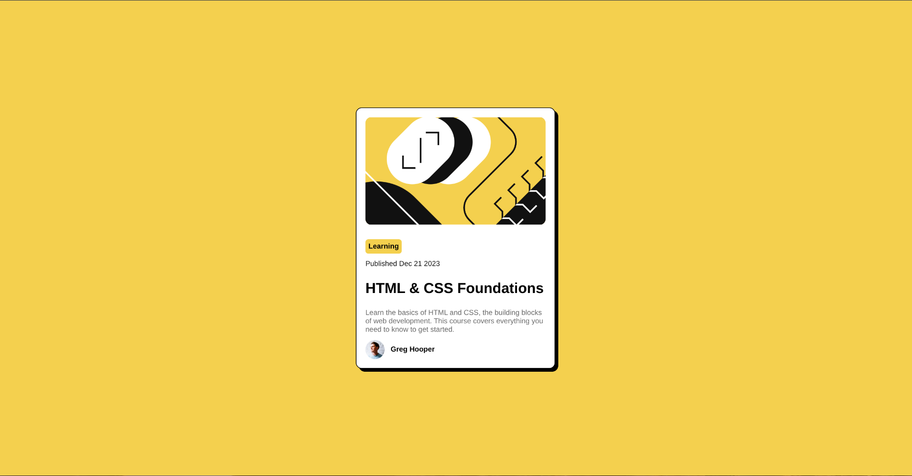

# Frontend Mentor - Blog card component solution

This is a solution to the Blog card component challenge on Frontend Mentor. Frontend Mentor challenges help you improve your coding skills by building realistic projects. 

## Table of contents

- [Overview](#overview)
  - [Screenshot](#screenshot)
  - [Links](#links)
- [My process](#my-process)
  - [Built with](#built-with)
  - [What I learned](#what-i-learned)
- [Author](#author)

## Overview

### Screenshot

### Links

- Solution URL: [https://github.com/rylry/blog-card-component-main](https://github.com/rylry/blog-card-component-main)
- Live Site URL: [https://rylry.github.io/blog-card-component-main/](https://rylry.github.io/blog-card-component-main/)

## My process

### Built with

- Semantic HTML5 markup
- CSS custom properties

### What I learned

I learned how to use CSS to make a simple design

## Author

- Rylan Ray
- Frontend Mentor - [@rylry](https://www.frontendmentor.io/profile/rylry)
